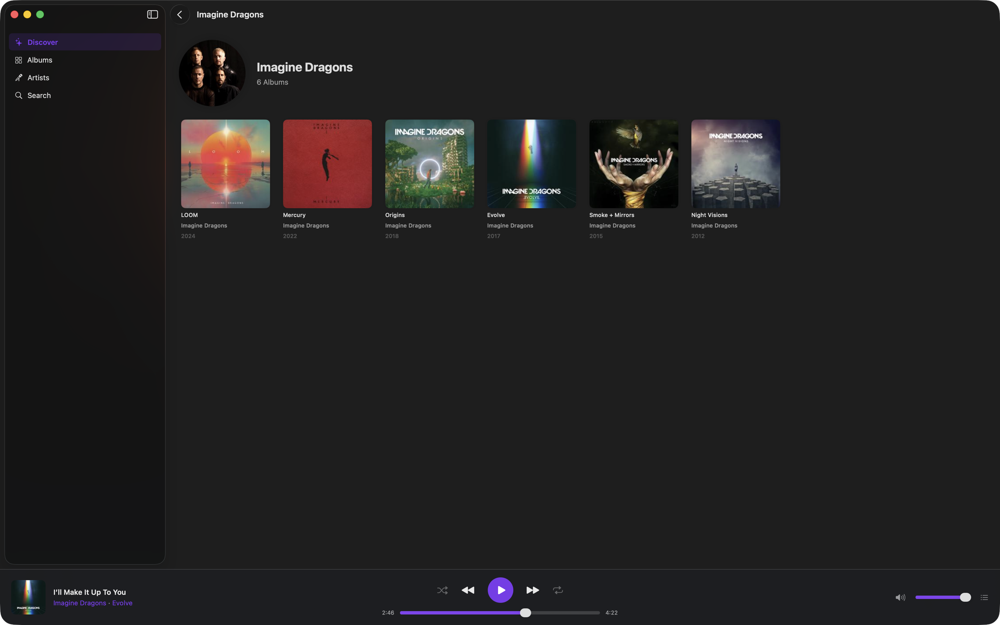
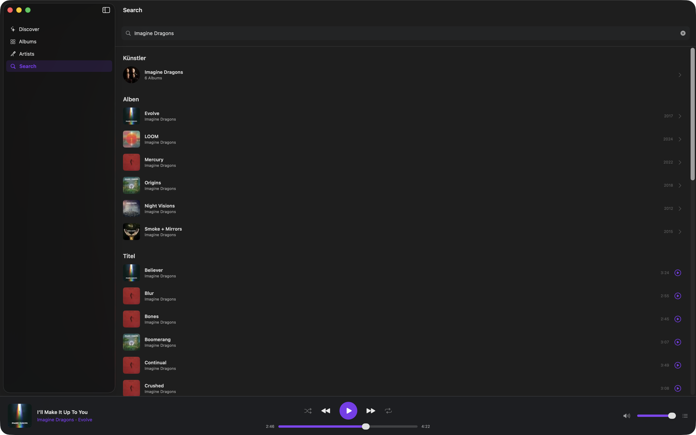

<p align="left">
  
</p>

# Shelv Desktop

A native, album and artist focused macOS client for [Navidrome](https://www.navidrome.org/) and Subsonic-compatible music servers, built with SwiftUI.


## Features

- **Browse your library** — Albums, Artists, and Discover views with recently added, recently played, frequently played, and random albums
- **Full playback control** — Play, pause, seek, skip with shuffle, repeat, and a persistent footer player bar
- **Smart mixes** — One-tap shuffled queues based on newest or most played tracks
- **Smart queue system** — Play Next, Album queue, and a user backlog (up to 200 songs); shuffle merges all three queues into one mixed list and restores the original order when turned off
- **Search** — Find tracks, albums, and artists on your server
- **Cover art** — Cached artwork throughout the UI
- **Media key support** — Native integration with macOS media controls and lock screen
- **Multiple servers** — Manage and switch between Subsonic/Navidrome server configurations
- **Theming** — Choose an accent color to personalize the interface
- **Settings** — Configurable via a dedicated Settings window

## Requirements

- macOS 14 (Sonoma) or later
- Xcode 16 or later
- A running [Navidrome](https://www.navidrome.org/) or Subsonic-compatible server

## Getting Started

1. Clone the repository:
   ```bash
   git clone https://github.com/gatzenga/Shelv-Desktop.git
   ```
2. Open `Shelv Desktop.xcodeproj` in Xcode.
3. Select a Mac target and hit **Run** (`⌘R`).
4. On first launch, enter your server URL and credentials in the login screen.

> No external dependencies or Swift Package Manager packages are required — the project is fully self-contained.

## Architecture

```
Shelv_DesktopApp  (@main)
├── AppState.shared          — central ObservableObject (login state, navigation, theme)
├── SubsonicAPIService.shared — API calls with MD5 authentication (CryptoKit)
└── AudioPlayerService.shared — AVPlayer, 3-queue system, MPRemoteCommandCenter
```

The navigation is built entirely on `NavigationSplitView` + `NavigationStack` with value-based `NavigationLink`s — no legacy `NavigationView`.

### Queue System

| Queue | Priority | Description |
|---|---|---|
| `playNextQueue` | Highest | Tracks queued via "Play Next" |
| `queue` | Normal | Current album / playback context |
| `userQueue` | Lowest | User backlog, max 200 songs |

Playback order: `playNextQueue` → `queue[currentIndex+1...]` → `userQueue` (one track at a time, not as a block).

**Shuffle** — When enabled, all three queues are merged into a single shuffled list inside `queue`; `playNextQueue` and `userQueue` are cleared. A snapshot of the pre-shuffle state is saved. When shuffle is disabled, the original order is restored, keeping only the tracks that have not been played yet. Tracks added while shuffle is active (via "Play Next" or "Add to Queue") are inserted at a random position in the shuffled queue and are mirrored into the snapshot so they reappear in the correct section when shuffle is turned off. The queue popover shows a single "Shuffled Queue" section while shuffle is active.

**Repeat**
- **Off** — Stops after the last track
- **All** — Wraps back to the start of the queue (reshuffled if shuffle is on)
- **One** — Replays the current track on natural end; a manual skip advances to the next track

**Jump** — Clicking any track in the queue removes it from its position, inserts it directly after the current track, and starts playback immediately. Nothing before it is discarded.

## Supported Audio Formats

Shelv Desktop streams audio using `format=raw` (no server-side transcoding) and relies on AVFoundation for decoding: MP3, AAC, M4A, ALAC, WAV, AIFF, FLAC, Opus.

## Authentication

Credentials are authenticated using the Subsonic API's token-based method: `MD5(password + salt)` via Apple's CryptoKit framework. Passwords are never sent in plain text.

## Contributing

Pull requests are welcome. For larger changes, please open an issue first to discuss what you'd like to change.

## License

See [LICENSE](LICENSE) for details.

## Screenshots

<p align="center">
  
  
</p>
<p align="center">
  
  
</p>
<p align="center">
  
  
</p>
