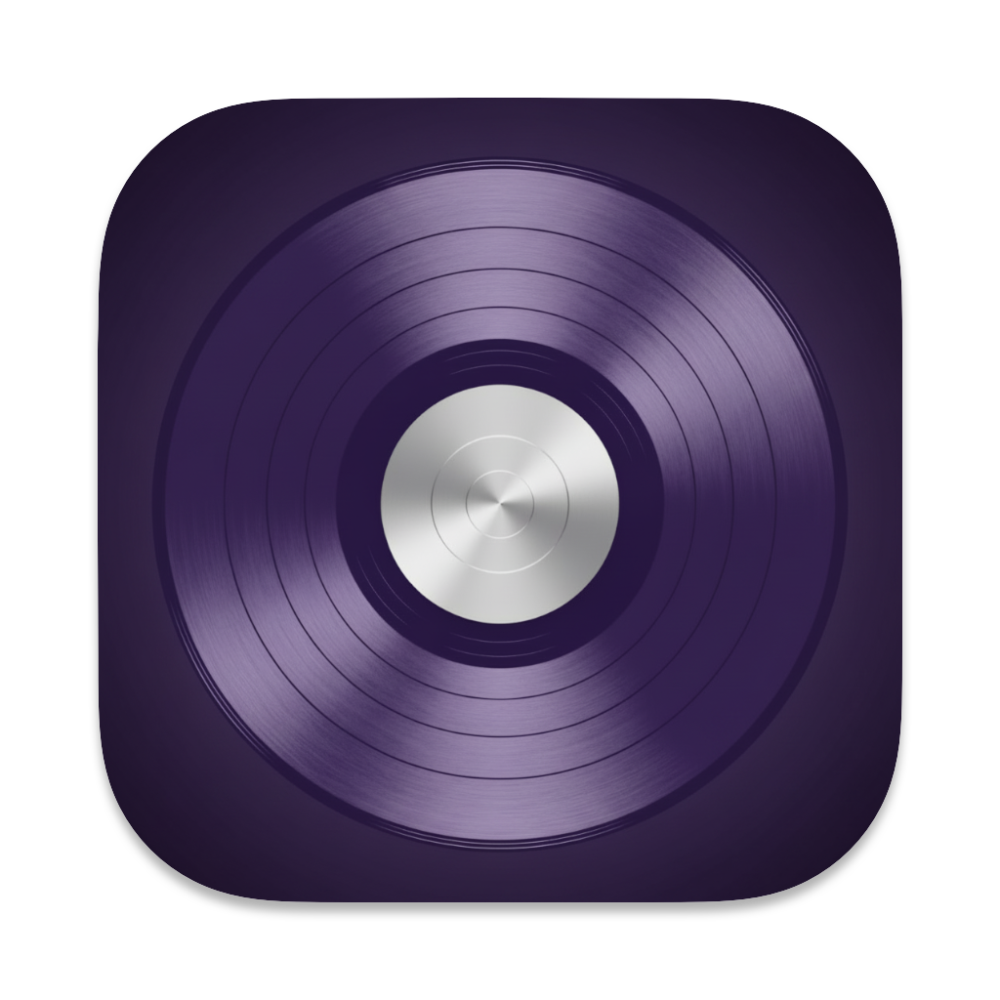

<p align="left">
  
</p>

# Shelv Desktop

A native macOS client for [Navidrome](https://www.navidrome.org/) and Subsonic-compatible music servers, built with SwiftUI.


## Features

- **Browse your library** — Albums, Artists, and Discover views
- **Full playback control** — Play, pause, seek, skip with a persistent footer player bar
- **Smart queue system** — Play Next, Album queue, and a user backlog (up to 200 songs)
- **Search** — Find tracks, albums, and artists on your server
- **Cover art** — Cached artwork throughout the UI
- **Media key support** — Native integration with macOS media controls and lock screen
- **Multiple servers** — Manage and switch between Subsonic/Navidrome server configurations
- **Theming** — Choose an accent color to personalize the interface
- **Settings** — Configurable via a dedicated Settings window

## Requirements

- macOS 14 (Sonoma) or later
- Xcode 16 or later
- A running [Navidrome](https://www.navidrome.org/) or Subsonic-compatible server

## Getting Started

1. Clone the repository:
   ```bash
   git clone https://github.com/gatzenga/Shelv-Desktop.git
   ```
2. Open `Shelv Desktop.xcodeproj` in Xcode.
3. Select a Mac target and hit **Run** (`⌘R`).
4. On first launch, enter your server URL and credentials in the login screen.

> No external dependencies or Swift Package Manager packages are required — the project is fully self-contained.

## Architecture

Shelv Desktop follows a clean MVVM structure:

```
Shelv_DesktopApp  (@main)
├── AppState.shared          — central ObservableObject (login state, navigation, theme)
├── SubsonicAPIService.shared — API calls with MD5 authentication (CryptoKit)
└── AudioPlayerService.shared — AVPlayer, 3-queue system, MPRemoteCommandCenter
```

The navigation is built entirely on `NavigationSplitView` + `NavigationStack` with value-based `NavigationLink`s — no legacy `NavigationView`.

### Queue System

| Queue | Priority | Description |
|---|---|---|
| `playNextQueue` | Highest | Tracks queued via "Play Next" |
| `queue` | Normal | Current album / playback context |
| `userQueue` | Lowest | User backlog, max 200 songs |

## Authentication

Credentials are authenticated using the Subsonic API's token-based method: `MD5(password + salt)` via Apple's CryptoKit framework. Passwords are never sent in plain text.

## Contributing

Pull requests are welcome. For larger changes, please open an issue first to discuss what you'd like to change.

## License

See [LICENSE](LICENSE) for details.
