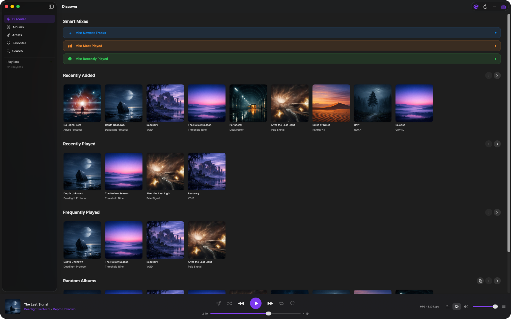
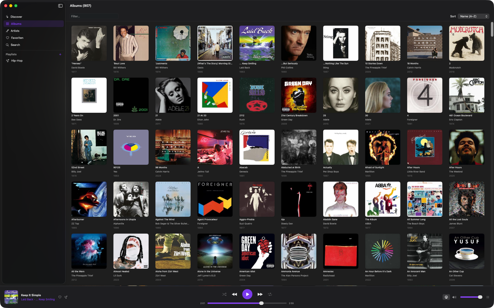
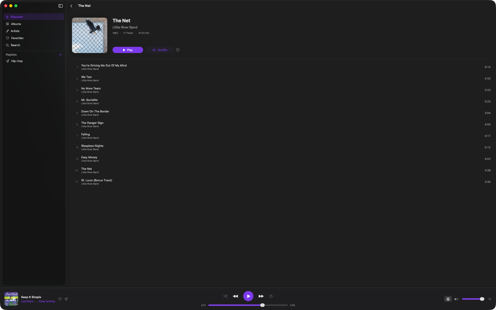
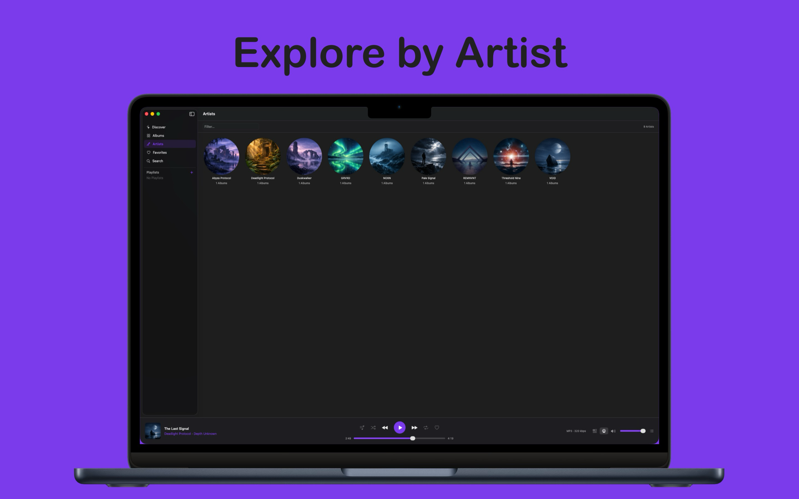
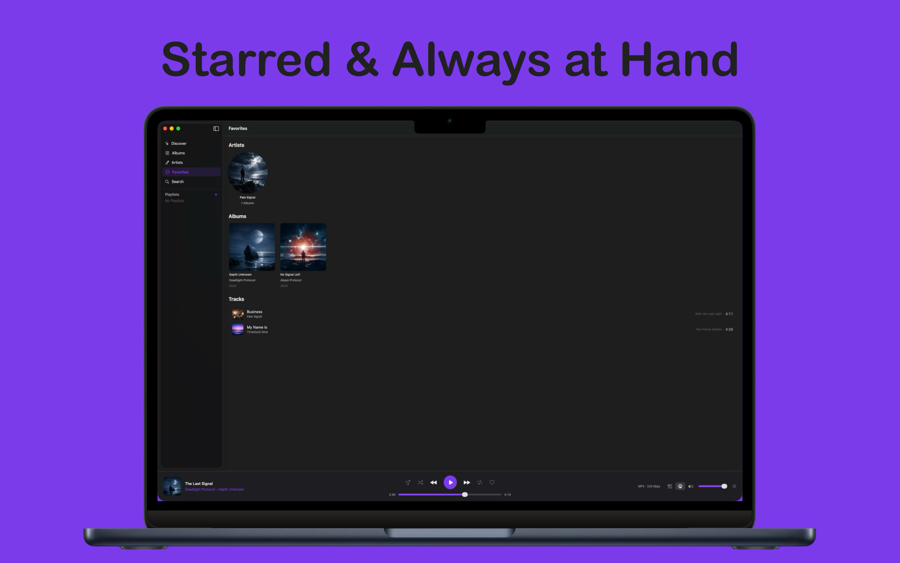

<p align="left">
  
</p>

# Shelv Desktop

A native, album and artist focused macOS client for [Navidrome](https://www.navidrome.org/) and Subsonic-compatible music servers, built with SwiftUI. Also available as a [native iOS/iPadOS app](https://github.com/gatzenga/Shelv).

**TestFlight:** https://testflight.apple.com/join/6FMa77Ks  
**Discord:** https://discord.gg/zU3qv9v6Vn


## Features

### Library
- **Albums and Artists** — Browse your full library in a responsive grid with a live filter field and sort options (alphabetical, most played, recently added)
- **Quick actions** — Right-click any album or artist card for a context menu (Play, Shuffle, Play Next, Add to Queue, Favorite, Add to Playlist)
- **Artist detail** — Dedicated Play and Shuffle buttons on the artist page; album grid sorted by year

### Discover
- **Shelves** — Four horizontal scroll sections: Recently Added, Recently Played, Frequently Played, and Random Albums
- **Smart Mixes** — Three one-tap buttons that build a shuffled queue from your newest tracks, most played tracks, or recently played tracks
- **Random Albums** — Refresh the random selection at any time with a dedicated shuffle button
- **Insights** — A ranked overview of your most played artists, albums, and songs, pulled directly from your server's play count data. The top three entries are highlighted; play counts are shown as badges next to each entry. Accessible via the chart icon in the top-right corner of Discover

### Playback
- **Persistent footer player** — Always-visible player bar at the bottom of the window with cover art, track info, seekbar with elapsed/remaining time, volume slider, and all transport controls (shuffle, previous, play/pause, next, repeat)
- **Full controls** — Shuffle, three repeat modes (Off / All / One), and direct navigation to the artist or album of the current track
- **Crossfade** — Smooth crossfade between tracks with a configurable duration (1–12 s); enable and adjust it in Settings
- **Media key support** — Full integration with macOS media keys and the Now Playing widget via MPRemoteCommandCenter

### Queue
- **Three-tier queue** — Play Next (highest priority), Album queue (current context), and User Queue (backlog); all unlimited
- **Queue popover** — Click the queue button in the player bar to open a popover showing all three sections; drag to reorder or swipe to delete any track
- **Shuffle** — Merges all three queues into one shuffled list; a snapshot preserves the original order so it can be fully restored when shuffle is turned off. When an album or artist is started via Shuffle, the shuffled order itself becomes the reference — disabling shuffle mid-playback keeps the same shuffled sequence without losing any tracks
- **Persistent state** — Queue, current track, playback position, shuffle state, and repeat mode all survive app restarts

### Favorites *(optional)*
- Star songs, albums, and artists — synced to the server via the Subsonic API
- A dedicated Favorites view in the sidebar groups starred artists, albums, and songs
- Favorite and unfavorite directly from context menus, the player bar, and track lists
- Can be enabled or disabled in Settings; when disabled, all related UI elements are hidden

### Playlists *(optional)*
- Browse server playlists from the sidebar; view the full tracklist for each playlist
- Add songs or full albums to existing playlists or create a new one on the fly — available via context menus and the player bar
- Rename or delete playlists directly from the playlist detail view
- Can be enabled or disabled in Settings; when disabled, all related UI elements are hidden

### Lyrics
- Synced and plain-text lyrics displayed in a popover from the player bar, with automatic line highlighting and scrolling for time-coded tracks
- Lyrics are fetched from your Navidrome server first; if none are stored there, Shelv Desktop falls back to [lrclib.net](https://lrclib.net) automatically
- Each song's lyrics are cached locally so they load instantly after the first fetch
- **Auto-load** — when enabled in Settings, lyrics are fetched in the background as soon as a song starts playing
- **Bulk download** — a one-click option in Settings pre-fetches lyrics for your entire library in the background, with a live progress counter

### Search
- Find artists, albums, and tracks on your server from a dedicated Search view in the sidebar

### Settings
- **Server** — View connection details and log out; run a full library scan with progress indicator and last-sync timestamp
- **Appearance** — Choose between Light, Dark, and System mode; pick one of ten accent colors
- **Cache** — See the current cover art cache size and clear it with a single tap
- **Crossfade** — Enable crossfade and set the fade duration
- **Lyrics** — Toggle auto-load and run a bulk download for your entire library
- **Favorites & Playlists** — Toggle each feature on or off independently

### Cover Art
- Actor-isolated image cache (NSCache + disk) with concurrent deduplication — `AsyncImage` is never used directly

## Requirements

- macOS 14 (Sonoma) or later
- Xcode 16 or later
- A running [Navidrome](https://www.navidrome.org/) or Subsonic-compatible server

## Getting Started

1. Clone the repository:
   ```bash
   git clone https://github.com/gatzenga/Shelv-Desktop.git
   ```
2. Open `Shelv Desktop.xcodeproj` in Xcode.
3. Select a Mac target and hit **Run** (`⌘R`).
4. On first launch, enter your server URL and credentials in the login screen.

> No external dependencies or Swift Package Manager packages are required — the project is fully self-contained.

## Architecture

```
Shelv_DesktopApp  (@main)
├── AppState.shared           — central ObservableObject (login state, navigation, theme)
├── SubsonicAPIService.shared — API calls with MD5 authentication (CryptoKit)
└── AudioPlayerService.shared — AVPlayer, 3-queue system, MPRemoteCommandCenter (@MainActor)
```

Navigation is built entirely on `NavigationSplitView` + `NavigationStack` with value-based `NavigationLink`s — no legacy `NavigationView`.

### Queue System

| Queue | Priority | Description |
|---|---|---|
| `playNextQueue` | Highest | Tracks queued via "Play Next" |
| `queue` | Normal | Current album / playback context |
| `userQueue` | Lowest | User backlog (unlimited) |

Playback order: `playNextQueue` → `queue[currentIndex+1...]` → `userQueue` (one track at a time, not as a block).

**Shuffle** — When enabled, all three queues are merged into a single shuffled list inside `queue`; `playNextQueue` and `userQueue` are cleared. A snapshot of the pre-shuffle state is saved. When shuffle is disabled, the original order is restored, keeping only the tracks that have not been played yet. Tracks added while shuffle is active are inserted at a random position and mirrored into the snapshot so they reappear in the correct section when shuffle is turned off. When playback is started via the Shuffle action on an album or artist, all tracks are shuffled upfront and the snapshot stores this shuffled order — so disabling shuffle mid-playback restores the same shuffled sequence without losing any tracks.

**Repeat**
- **Off** — Stops after the last track
- **All** — Wraps back to the start of the queue (reshuffled if shuffle is on)
- **One** — Replays the current track on natural end; a manual skip advances to the next track

**Jump** — Clicking any track in the queue removes it from its position, inserts it directly after the current track, and starts playback immediately. Nothing before it is discarded.

## Supported Audio Formats

Shelv Desktop streams audio using `format=raw` (no server-side transcoding) and relies on AVFoundation for decoding: MP3, AAC, M4A, ALAC, WAV, AIFF, FLAC, Opus.

## Authentication

Credentials are authenticated using the Subsonic API's token-based method: `MD5(password + salt)` via Apple's CryptoKit framework. Passwords are never sent in plain text.

## Contributing

Pull requests are welcome. For larger changes, please open an issue first to discuss what you'd like to change. Feature ideas, feedback, and general discussion are welcome on the [Discord server](https://discord.gg/zU3qv9v6Vn).

## License

See [LICENSE](LICENSE) for details.

## Screenshots

<p align="center">
  
  
</p>
<p align="center">
  
  
</p>
<p align="center">
  
</p>


